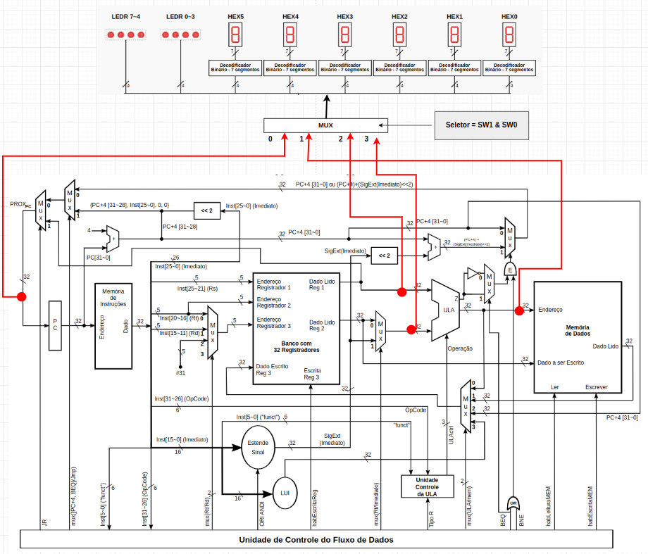

## 🖥️ MIPS-Processor

Este projeto é a implementação de um processador RISC de 32 bits, compatível com o MIPS DLX.

Organização do processador : ciclo-único.

* Placa utilizada no projeto : [DE0-CV Board](https://www.terasic.com.tw/cgi-bin/page/archive.pl?Language=English&CategoryNo=165&No=921)

* Software utilizado na programação do projeto : [Quartus Prime Lite, versão 20.1](https://www.intel.com/content/www/us/en/collections/products/fpga/software/downloads.html?s=Newest&edition=lite&f:guidetmD240C377263B4C70A4EA0E452D0182CA=%5BIntel%C2%AE%20Quartus%C2%AE%20Prime%20Design%20Software%3BIntel%C2%AE%20Quartus%C2%AE%20Prime%20Lite%20Edition%5D)

Para entender mais sobre o projeto, confira o arquivo `Projeto_MIPS_ManualUso.pdf`.

#### 📊️ Diagrama da Arquitetura

<div align="center">
      
</div>

#### 🧪️ Arquivo de teste (`.mif` da ROM)

```bash
-- Copyright (C) 2017  Intel Corporation. All rights reserved.
-- Your use of Intel Corporation's design tools, logic functions
-- and other software and tools, and its AMPP partner logic
-- functions, and any output files from any of the foregoing
-- (including device programming or simulation files), and any
-- associated documentation or information are expressly subject
-- to the terms and conditions of the Intel Program License
-- Subscription Agreement, the Intel Quartus Prime License Agreement,
-- the Intel FPGA IP License Agreement, or other applicable license
-- agreement, including, without limitation, that your use is for
-- the sole purpose of programming logic devices manufactured by
-- Intel and sold by Intel or its authorized distributors.  Please
-- refer to the applicable agreement for further details.

WIDTH=32;
DEPTH=64;
ADDRESS_RADIX=DEC;
DATA_RADIX=HEX;

CONTENT BEGIN
      -- Valores iniciais no banco de registradores:
      -- $t0   (#8) := 0x00
      -- $t1   (#9) := 0x0A
      -- $t2  (#10) := 0x0B
      -- $t3  (#11) := 0x0C
      -- $t4  (#12) := 0x0D
      -- $t5  (#13) := 0x16

    0    :   AC090008; --sw $t1 8($zero)     (m(8) := 0x0000000A)
    1    :   8C080008; --lw $t0 8($zero)     ($t0 := 0x0000000A)
    2    :   012A4022; --sub $t0 $t1 $t2     ($t0 := 0xFFFFFFFF)
    3    :   012A4024; --and $t0 $t1 $t2     ($t0 := 0x0000000A)
    4    :   012A4025; --or $t0 $t1 $t2      ($t0 := 0x0000000B)
    5    :   3C08FFFF; --lui $t0 0xFFFF      ($t0 := 0xFFFF0000)
    6    :   2128000A; --addi $t0 $t1 0x000A ($t0 := 0x00000014)
    7    :   31080013; --andi $t0 $t0 0x0013 ($t0 := 0x00000010)
    8    :   35880007; --ori $t0 $t4 0x0007  ($t0 := 0x0000000F)
    9    :   2928FFFF; --slti $t0 $t1 0xFFFF ($t0 := 0x00000000)
    10   :   010A4020; --add $t0 $t0 $t2     ($t0 := 0x0000000B)
                          --segunda execução ($t0 := 0x00000016)
    11   :   150DFFFE; --bne $t0 $t5 0xFFFE  (pc := #10)
                          --segunda execução (pc := #12)
    12   :   012A402A; --slt $t0 $t1 $t2     ($t0 := 0x00000001)
    13   :   010A4020; --add $t0 $t0 $t2     ($t0 := 0x0000000C)
                          --segunda execução ($t0 := 0x00000017)
    14   :   110BFFFE; --beq $t0 $t3 0xFFFE  (pc := #13)
                          --segunda execução (pc := #15)
    15   :   0C00001F; --jal 0x00001F        (pc := #31)
    17   :   08000000; --j 0x000000          (pc := #0)
    31   :   03E00008; --jr $ra              (pc := #17)
END;
```
<br>
@2023, Insper. Sexto Semestre, Engenharia da Computação.
